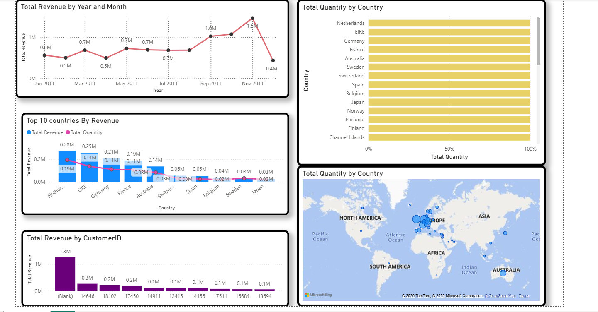

# 📊 Online Retail Dashboard (Power BI)

## 📌 Project Overview
This project presents an **Online Retail Business Analytics Dashboard** built using **Power BI**.  
It provides a comprehensive view of sales performance across **time, geography, and customer segments**, enabling data-driven decision-making.

---

## 🚀 Features
- **Revenue Trends**: Line chart showing monthly revenue fluctuations in 2011.  
- **Geographic Analysis**: Country-wise breakdown of total quantity and revenue.  
- **Top Customers**: Identification of high-value customers contributing to revenue.  
- **Comparative Insights**: Combined bar and line chart comparing revenue vs. quantity for top countries.  
- **Interactive Map**: World map visualization highlighting sales distribution globally.

---

## 🖼️ Dashboard Preview

---

## 📈 Insights
- **Revenue Trends**:  
  - Revenue peaked in **November 2011 (1.5M)**, showing strong seasonal demand.  
  - Lowest revenue observed in **July 2011 (0.2M)**, indicating possible off-season.  

- **Top Countries by Revenue**:  
  - **Netherlands, EIRE, Germany, and France** lead in revenue contribution.  
  - Revenue and quantity are positively correlated, with higher sales volume driving revenue.  

- **Customer Analysis**:  
  - A significant portion of revenue (**1.3M**) comes from customers with missing IDs, highlighting a **data quality issue**.  
  - Key customers like **14646, 18102, and 17450** contribute substantially to revenue.  

- **Geographic Distribution**:  
  - Sales are concentrated in **Europe**, with notable contributions from **Australia, Japan, and North America**.  
  - Balanced quantity distribution across countries suggests consistent demand.

---

## 👨‍💻 About Me
**Vishnu**  
- 🎓 **Computer Science Graduate** from Gates Institute of Technology  
- 💼 **Aspiring Data Analyst** with internship experience at Nyeras Edutech and Fortinet Academy  
- 🛠️ Skilled in **Python, SQL, Power BI, Excel**, and advanced data visualization libraries  
- 📊 Passionate about **ML/NLP, geospatial analytics, and healthcare projects**  
- 🌍 Based in **Bengaluru, India** (originally from Andhra Pradesh)  
- 📈 Goals:  
  - Improve SQL, dashboards, and reporting skills  
  - Build a strong portfolio and LinkedIn presence  
  - Deliver professional, stakeholder-ready analytics solutions  

---
